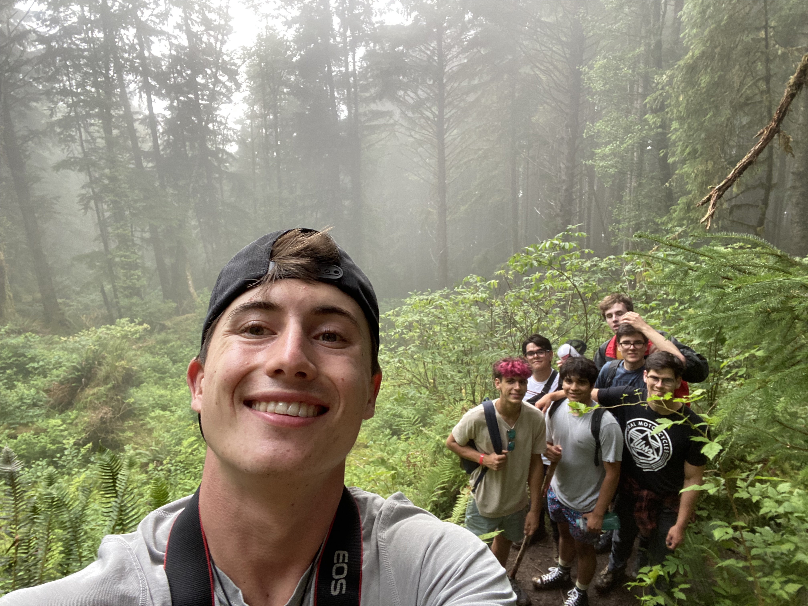

## Overview
I'm a Junior at UC Berkeley studying Computer Science and Philosophy. 
I use this site to document my personal/professional projects and share a bit of my writing.
Feel free to explore or reach out—my social media is linked above.

## A little more about me...
I'm call San Diego my hometown, but have lived in many places including Virginia and Yokosuka Japan (about an hour south of Tokyo). 
I love playing guitar, surfing, climbing, and generally just being outside. I came up to UC Berkeley in the fall of 2020, and quickly fell in love 
with learning about the development of software systems, and effects those technologies have on our personal, social, and economic lives. 

I started off my professional life at the private equity firm *StepStone Global*, where I spent a summer working as an analyst tracking portfolio company performance 
and developing software tools to make my team's (and my own) work more efficient. From there I left to work at the Salk Institute for Biological sciences out of 
UCSD in the Waitt Advanced Biophotonics core. There I worked with the CDeep3M cloud-based deep neural network and Amazon Web Services to automate segmentation of 
electron micrographs of microglia, and ultimately the creation of 3D models of these neural structures to be used in research on neurodegenerative diseases like Alzheimer's 
and dementia. From there I went back into the world of finance at Hankey Group/Credit Union Leasing of America (CULA), where I created models of portfolio risk and developed and an API 
to allow lease originators tied to CULA seamlessly access up to date residuals for car models via VIN numbers.

I am currently working on a project to synthesize my education in Philosophy and Computer Science by analyzing how market and 
consumer pressures created the environment that our current social media platforms were developed under and thrive in. 
I am interested particularly in the ethical consequences that certain design decisions have on consumer wellbeing. 
The ultimate goal is to design a social media platform that takes into account these pitfalls; levying the power of connected 
technologies to connect people with similar interests in their proximity and beyond, and (most importantly) mitigating the 
social, psychological, and economic costs associated with dominant platofrms to the consumer.

> #### Some Terms
> - Segmentation: in this context refers to tracings made of images in order to highlight specific structures
> - Microglia: cells residing in the central nervous system responsible for the development and maintainence of synapses (the *atoms* of neural pathways)
> - Electron Micrographs: 2D images taken on a scanning electron microscope
