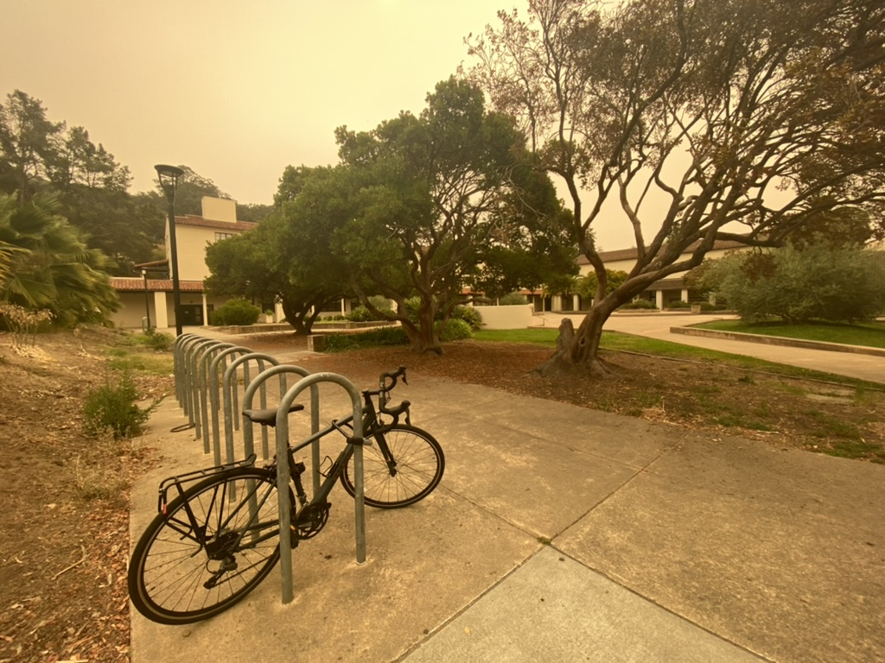

## Moving Up
I visited Berkeley for the first time in April of 2020 no more than a few days after I'd accepted my offer of admission. 
The trip over from San Diego was no more than 7 hours up the I-5, and at the time gas was still reasonably cheap, 
so I figured it would be worthwhile to make it up there for a day trip to get my bearings of the campus before moving up. 
The Berkeley that greeted me was quiet, with crisp air and fresh cherry blossoms on the trees. I stopped by a small coffee 
shop across from Sather Gate and got the impression that I was the first to come through their front door in quite a while 
from the enthusiasm the barista had making my drink and ringing it up. The campus itself was empty, save for the groundskeepers; that 
emptiness served to make the libraries and lecture halls feel grand.

The second time I came to Berkeley, my truck was packed with all of what I could imagine to be worthwhile bringing up to college 
with me. Two surfboards, a coffee machine, a bike. Plenty more clothes than I would need being all but confined to my small dorm in the heat of the pandemic
in fall of 2020. On the same interstate from Bakersfield to Dublin (east of San Francisco, not Ireland) the sky was dark and heavy with smoke. That smoldering blanket left the air 
made the already incredibly warm central valley summer unbearable. That smoke followed me into the east bay a few weeks later. However, I escaped the Central California hellfire for 
the meantime and got to meet my future classmates in the dorms and on the memorial glade under clear skies.

The energy in those first weeks was electric. After months of having all previous norms and sense of control stripped by the pandemic this new 
place presented an opportunity for all of us living there to fight back by remaking ourselves in spite of the changing world. 
My peers and I (who were lucky enough to be on campus that is) explored the empty bay area together. The beaches, the mountains.

But the smoke followed and burned the sky, turning it red and dark. *Day became night* that first morning I woke up to these skies. 
The air was thick and toxic, and in an almost hilariously direct way played out and analogy for the greater threat that loomed over all of us 
in that time.

(...to be continued)